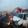
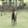
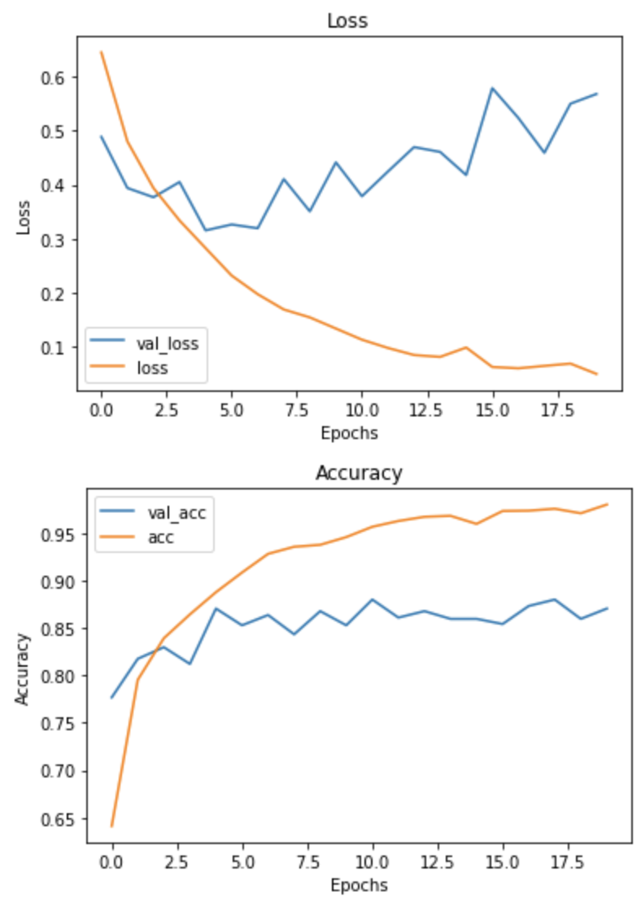
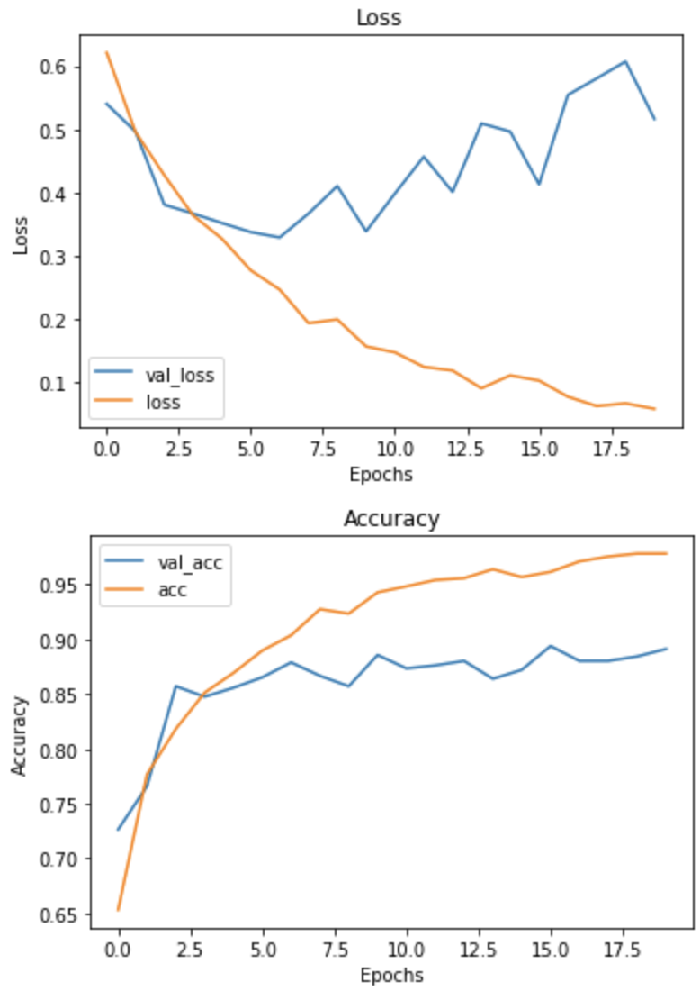

# Recognizing Car Crashes With Neural Networks

## Background
Responding to car crashes in the shortest amount of time is essential when treating injuries. In the U.S, the average amount of time it takes for emergency services to reach a car crash is 15 minutes [[1]](https://www.autoinsurancecenter.com/emergency-response-times.htm). Humans are simply too slow on reporting accidents to emergency services. However, humans report accidents to Waze a full 4 minutes faster than to emergency services [[2]](https://newsroom.ucla.edu/releases/waze-accident-reports-emergency-response).

## Solution
Image recognition may be a solution to respond to car accidents faster. Software can continuously monitor traffic and look for car accidents. When an accident is detected, an alert can be sent to emergency services to dispatch help. 

## Analysis
1. Can we train a model to recognize car accidents?
2. Can a model be deployed in a cost-effective way?

## Data Description
A dataset was found with 2398 photos that showed car crashes. The data set contained 2500 photos of various things that included cars not in accidents. All the photos were in a 28x28 resolution, so it was hard to see for humans.

## Data Cleaning
The data was not modified in any way. The storage of the data was the only thing that was changed. The data was separated into train and test sets.

## Data Exploration
As stated earlier, images are in a 28x28 resolution. It is difficult to see them without aid. 

## Data Preprocessing
### Base Iteration
- Array was normalize between 0 and 1.

### Iteration 1
- Array was normalize between 0 and 1.
- A greyscale filter was applied.

## Model
The model contained 3 hidden layers with maxpooling and dropout. The model used was the same one from a keras article on training models with small datasets. In can be found [here](https://blog.keras.io/building-powerful-image-classification-models-using-very-little-data.html).

|Iteration|Base|Greyscale|
|---|---|---|
|Accuracy|.91|.89|
|F1 Score (macro)|.91|.89|  

For both models, overfitting was a problem. Further adjusting is needed.

Base Model

Greyscale Model

### Future Work
The model with full RGB color was chosen because it was the best performing one. When it was tested with a small set of 8 photos, the model was biased towards classifying photos as car crashes. It had problems differentiating car crashes from traffic. The accuracy presented previously is the accuracy within the dataset used to train and test the model, but I do not forsee the accuracy holding in the real world. However, further training the model to understand the difference between car crashes and traffic is entirely possible and within reach.

## Conclusion
Training software to recognize car crashes is within reach of current technology, and it can be implemented in a cost-effective way. This is concluded based on a small sample and test. However, an issue can arise with the model being biased towards car crashes. More resources might be needed to analyze if an alert is a credible one. This can be an issue because resources be might give where they are not needed and taken away from places that are needed. More training could eliminate this issue. Furthermore, the model being biased towards car crashes might be beneficial because emergency services can be proactive in reaching car crashes.
